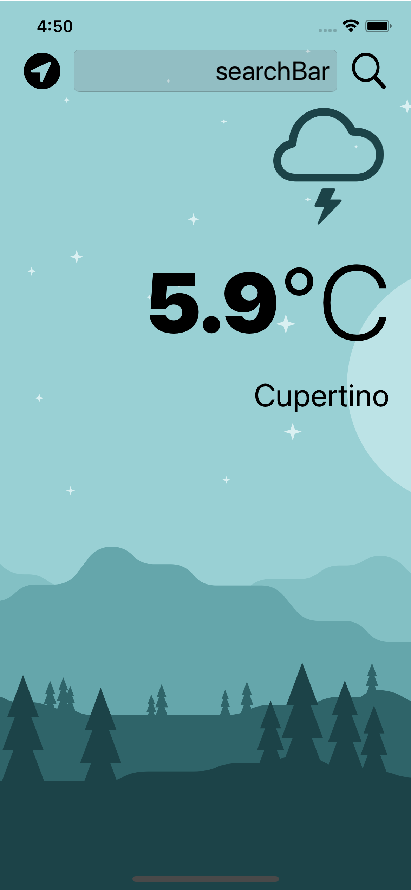
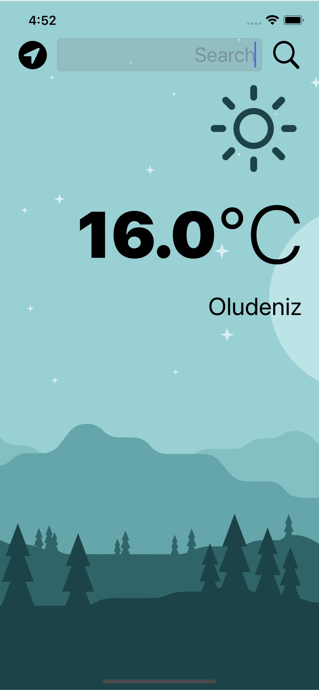

#  WeatherNow

## Main Features

 dark-mode enabled weather app.You can check the weather for the current location based on the GPS data from the iPhone as well as by searching for a city manually. 

## Requirements

To make the app work, you need to obtain an API key from the following website: https://openweathermap.org/api.

## What i have learned

* create a dark-mode enabled app.
* vector images as image assets.
* the delegate pattern.
* to use URLSession to network and make HTTP requests.
* Parse JSON with the native Encodable and Decodable protocols. 
* to use Grand Central Dispatch to fetch the main thread.
* to use Core Location to get the current location from the phone GPS. 

